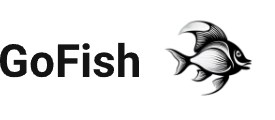

<p align="center">
  
</p>

## Overview
GoFish is an open-source chess engine project written in Golang. The project aims to assist developers who are looking to implement chess engines by providing a ready-to-use framework that includes common engine modules, such as board representation, move encoding, and UCI compatability. This allows developers to plug in custom search and evaluation modules, which constitutes the algorithmic and heuristic parts of a chess engine. GoFish also includes a default search and evaluation implementation which can be used to construct a working engine if required.  

If you use this work, please cite this [paper](https://www.sciencedirect.com/science/article/abs/pii/S0957417424007218).

## Basic Workflow
GoFish defines a contract for implementing custom search and evaluation modules. The contract is represented by Golang interfaces which requires implementation. If all functions defined in either interface are implemented by a Golang type, then that type can be used as a custom implementation which may be passed into the engine framwork to construct a working engine. 


## Usage
GoFish employs Golang as the language of choice. Hence, Golang developement and runtime tools should be installed from the [official download page](https://go.dev/dl/). The installer will guide you through the necessary steps. Make sure to allow the installer to add Golang to PATH to allow using command line tools easily.

A driver Golang module should be initialized locally in your required directory using the command `go mod init <module name>` which should create a `go.mod` and `go.sum` files in the workspace. The driver should introduce a Golang executable `main` package which imports GoFish and invokes either `NewDefaultEngineInterface()` which uses a default search and evaluation implementations, or `NewCustomEngineInterface(searcher, evaluator)` which requires custom implementations. Both the functions return an `EngineInterface` object which has a `StartEngine()` method used to initiate the engine.

> **_NOTE:_**  Depending on the version of Golang installed, you may need to run `go get github.com/A7mad-2000as/GoFish/chessEngine` after initializing the local Golang module and before using the imported GoFish module to be able to use it without errors.

A working driver which uses the default implementation would look like this:
```
package main

import (
	"github.com/A7mad-2000as/GoFish/chessEngine"
)

func main() {
	engineInterface := chessEngine.NewDefaultEngineInterface()
	engineInterface.StartEngine()
}
```

A custom implementation can be defined by implementing the `GameSearcher` and `Evaluator` interfaces defined in `chessEngine/interfaces.go`. The functions and their descriptions are given in the following two tables

### GameSearcher Interface
| Function        | Description           | Returns  |
| :------------- |:-------------| :-----|
| Reset()      | Reset the game searcher to the initial state. Called when `uci` command is received | - |
| ResetToNewGame()     | Setup the game searcher state so that a new chess game is now being searched. Called when `ucinewgame` command is received      | - |
| GetOptions() | Get the UCI options offered by the searcher. Useful for `option` and `setoption` UCI commands    |  A map keyed by the option name, with `EngineOption` values as defined in the `chessEngine/interfaces.go` file |
| Position() |   Returns the current position state    |  The current `Position` object depending on the search progress |
| RecordPositionHash(positionHash) | Add the given position hash to the history of encountered positions, useful for three-fold repetition detection | - |
| IniitalizeSearchInfo(fenString, evaluator) | Setup the game searcher state to consider the position described by the given FEN string. Called after `position` UCI command is received | - |
| InitializeTimeManager(remainingTime, increment, moveTime, movesToGo, depth, nodeCount) | Initialize the time manager by the timing information given using the parameters of the `go` UCI comand. The time value -1 indicates infinite time | - |
| StartSearch() | Begin a new Search based on the game searcher internal state. Called after `go` UCI command is received and after setting up internal state (i.e., position and time manager info). Ends after polling of the stop flag indicates that the search should end | The best move found by the search |
| StopSearch() | Stop an ongoing search by setting a stop flag and returning.  Called after `stop` UCI command is received      |  - |
| CleanUp() | Clean up any resources used be the engine before terminating completely. Called after `quit` UCI command is received      |  - |

### Evaluator Interface

| Function        | Description           | Returns  |
| :------------- |:-------------| :-----|
| EvaluatePosition(position)      | Get the static evaluation result  of the given position | The centipawn static evaluation score |
| GetMiddleGamePieceSquareTable()     | Get the middlegame piece square table scores. Used by the `Position` object to update scores incrementally after doing and undoing moves      | Middlegame piece square table |
| GetEndGamePieceSquareTable() | Get the endgame piece square table scores. Used by the `Position` object to update scores incrementally after doing and undoing moves    |  Endgame piece square table |
| GetMiddleGamePieceValues() | Get the piece material value during the middlegame phase. Used by the `Position` object to update scores incrementally after doing and undoing moves   |  Middlegame piece values in the following order: Pawn, Knight, Bishop, Rook, Queen, King |
| GetEndGamePieceValues() | Get the piece material value during the endgame phase. Used by the `Position` object to update scores incrementally after doing and undoing moves   |  Endgame piece values in the following order: Pawn, Knight, Bishop, Rook, Queen, King |
| GetPhaseValues()      | Get the phase weight of each piece type. Used for determination of the current phase of the game. Higher value biases the game towards middlegame rather than endgame | Phase values for each piece type in the following order: Pawn, Knight, Bishop, Rook, Queen, King |
| GetTotalPhaseWeight()      | Get The total phase score by summing up the phase values of each piece type scaled by the number of pieces. Mostly, each piece value should be scaled by the number of pieces in the starting position for both colors combined. For example, the pawn weight should be scaled by 16  | The total phase score |

An executable can be obtained by running `go build` inside the driver module directory. As most engines, GoFish does not have its own GUI and rather implements the UCI protocol which allows integration with many GUIs which implement the same protocol. Some of the most popular GUIs are: [Arena](http://www.playwitharena.de/), and [CuteChess](https://cutechess.com/). Instructions on how to load an engine executable is avaiable on the respective GUI page.


